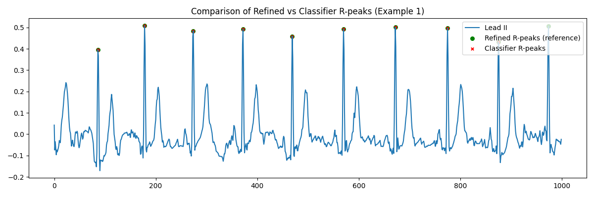

# R-Peak Detection

Below is an overview of our ECG R-peak detection and classifier training pipeline.

## Instruction 
1. **Download & unzip** the PTB-XL dataset (v1.0.3) from PhysioNet.  
2. **Copy** your `rpeak_classifier.py` script into the root of the unzipped folder:(ptb-xl-a-large-publicly-available-electrocardiography-dataset-1.0.3)
3. **`cd`** into that folder:
```bash
cd ptb-xl-a-large-publicly-available-electrocardiography-dataset-1.0.3
pip install wfdb numpy scipy pandas torch scikit-learn matplotlib(or any other related module)
python rpeak_classifier.py
```
4. **follow** instruction type in the sample rate, press enter to run 

## Data Preprocessing
1. **Lead II Extraction**  
   - Read raw `.dat`/`.hea` files with `wfdb.rdsamp(...)`.  
   - Select channel 1 (Lead II).

2. **Resampling**  
   - Prompt for a `target_fs` (default 500 Hz).  
   - Use `scipy.signal.resample()` to map any original sampling rate to `target_fs`.

3. **Filtering**  
   - Apply a zero-phase Butterworth band-pass (0.5 – 40 Hz) via  
     ```python
     nyq = 0.5 * fs
     b, a = butter(order=3, [0.5/nyq, 40/nyq], btype='bandpass')
     filtered = filtfilt(b, a, signal)
     ```

4. **Pan–Tompkins QRS Detection**  
   - Band-pass 5 – 15 Hz  
   - Differentiate → Square → Moving-window integrate (~150 ms)  
   - `scipy.signal.find_peaks()` with a min distance of 250 ms and adaptive threshold

5. **Peak Refinement**  
   - For each candidate, search ±10 samples in the raw signal to locate the true local maximum.

6. **Window Extraction**  
   - **Positive** windows: 128 samples centered on each refined R-peak.  
   - **Negative** windows: sample outside ±64 samples around true peaks (neg_ratio=5).

---

## Model Architecture

```text
Input: 1 × 128 window
 └─ Conv1d(1→16, kernel=5, padding=2)
     └─ ReLU
     └─ MaxPool1d(2)
 └─ Conv1d(16→32, kernel=5, padding=2)
     └─ ReLU
     └─ MaxPool1d(2)
 └─ Flatten → Linear((128/4)*32 → 64)
     └─ ReLU
     └─ Linear(64 → 1)
     └─ Sigmoid
Output: P(R-peak at center)

```

## Hyperparameter Summary

- **Sampling Rate (`target_fs`)**: 100 – 500 Hz (you choose at runtime; defaults to 500 Hz)  
- **Window Size**: 128 samples (~1.28 s at 100 Hz)  
- **Negative-to-Positive Ratio (`neg_ratio`)**: 5 negative windows for every true R-peak window  
- **Batch Size**: 64 windows per training step  
- **Learning Rate**: 1 × 10⁻³ (Adam optimizer)  
- **Epochs & Early Stopping**: up to 30 epochs with patience=5 on validation F₁  
- **Detection Threshold**: 0.85 probability for classifying a window as “R-peak”  
- **Minimum Peak Distance**: 0.3 s (distance=int(0.3 × fs) samples) between successive detections  

## Training logs



```text
the training result is saved in classifier_rpeak_testset.csv

```

# SCP codes Detection

Below is an overview of our ECG scp codes detection classifier training pipeline.(Due to limitation of hardware, only trained for 5 labels here)


## Instruction 
1. **Download & unzip** the PTB-XL dataset (v1.0.3) from PhysioNet.  
2. **Copy** your `rpeak_classifier.py` script into the root of the unzipped folder:(ptb-xl-a-large-publicly-available-electrocardiography-dataset-1.0.3)
3. **`cd`** into that folder:
```bash
cd ptb-xl-a-large-publicly-available-electrocardiography-dataset-1.0.3
pip install wfdb numpy scipy pandas torch scikit-learn matplotlib(or any other related module)
python scp_code_classifier.py
```
## Data Processing

### 1. Metadata & Label Extraction
- **Load** `ptbxl_database.csv` and parse each record’s `scp_codes` dictionary.  
- **Filter** to the top-5 diagnostic classes (`NORM`, `IMI`, `ASMI`, `LVH`, `NDT`), discarding any ECGs with none of these labels.  
- **Convert** each record’s label set into a fixed-length multi-hot vector for training.

### 2. Train / Validation / Test Split
- **Folds 1–8** → Training set  
- **Fold 9** → Validation set  
- **Fold 10** → Test set  

### 3. ECG Signal Preprocessing
- **Load** raw Lead II waveforms from the `.dat/.hea` files (originally at 500 Hz).  
- **Resample** to the user-specified target rate (e.g. 100, 250, or 500 Hz).  
- **Band-pass filter** (0.5–40 Hz, zero-phase Butterworth) to remove baseline wander and noise.

### 4. Snippet Windowing
- **Window length:** 10 seconds (i.e. `target_fs × 10` samples).  
- **Pad** shorter signals with zeros; **truncate** longer signals to ensure uniform length.

### 5. Dataset & DataLoader
- **Wrap** each filtered snippet and its multi-hot label into a PyTorch `Dataset`.  
- **Use** `DataLoader` to batch, shuffle, and feed data into the model during training, validation, and testing.

## Hyperparameters

- **Sampling Rate (`target_fs`)**: User‐specified (100, 250, or 500 Hz; default 500 Hz)  
- **Window Length**: 10 s of ECG (`window_size = target_fs × 10`)  
- **Batch Size**: 32  
- **Optimizer**: Adam  
- **Learning Rate**: 1 × 10⁻³  
- **Max Epochs**: 30  
- **Early Stopping Patience**: 7 epochs (stop if validation F₁-micro does not improve)  
- **Convolutional Blocks**: 5 layers, each with  
  - Kernel size = 7, padding = 3  
  - Filters = [32, 64, 128, 128, 256]  
  - BatchNorm → ReLU → MaxPool1d(2)  
- **Dropout**: 0.5 (applied before and after the 256-unit dense layer)  
- **Classifier Head**:  
  - Dense(Flattened → 256) → ReLU → Dropout  
  - Dense(256 → 5) → Sigmoid  
- **Inference Threshold**: 0.5 (probability cutoff for each SCP code)  
- **Metrics**:  
  - AUROC & AUPRC (macro)  
  - F₁-micro & F₁-macro  
  - Accuracy@3  
  - Brier score  

## Training logs


```text
the training result is saved in scp_code_predictions.csv

```